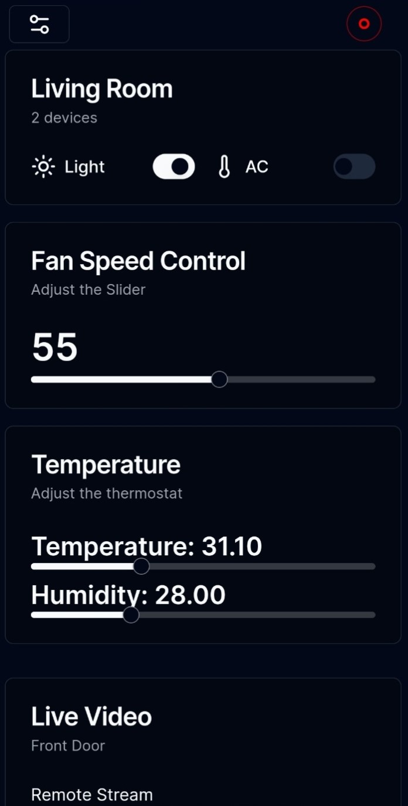
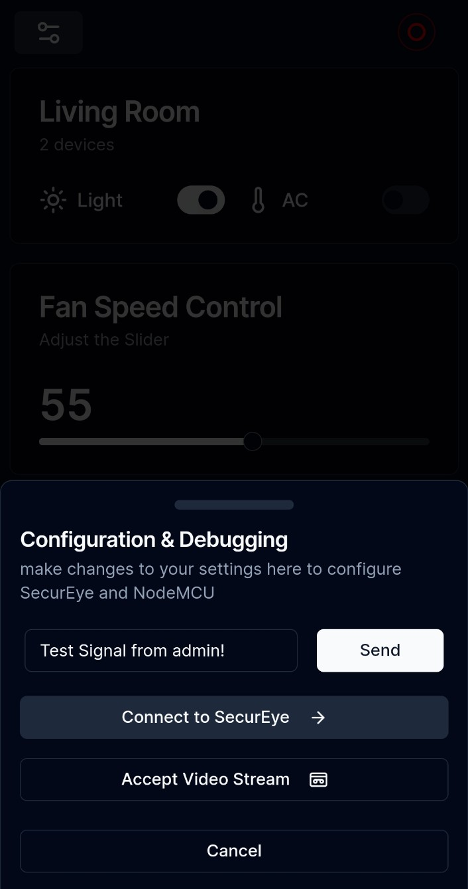
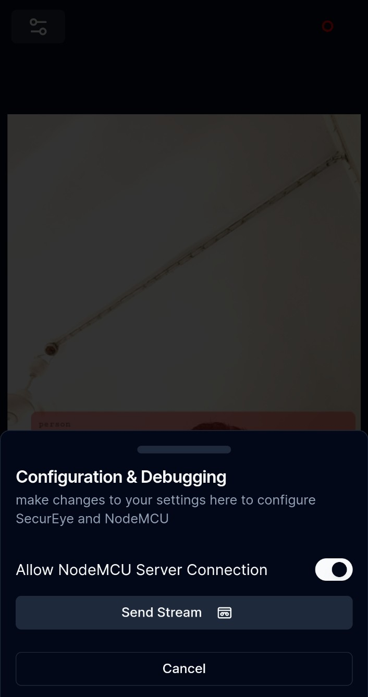
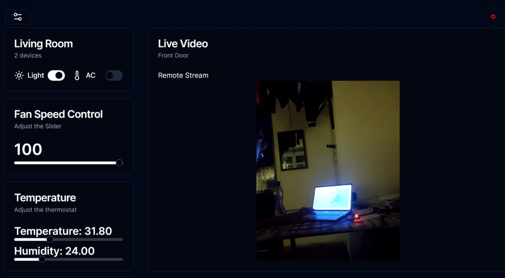
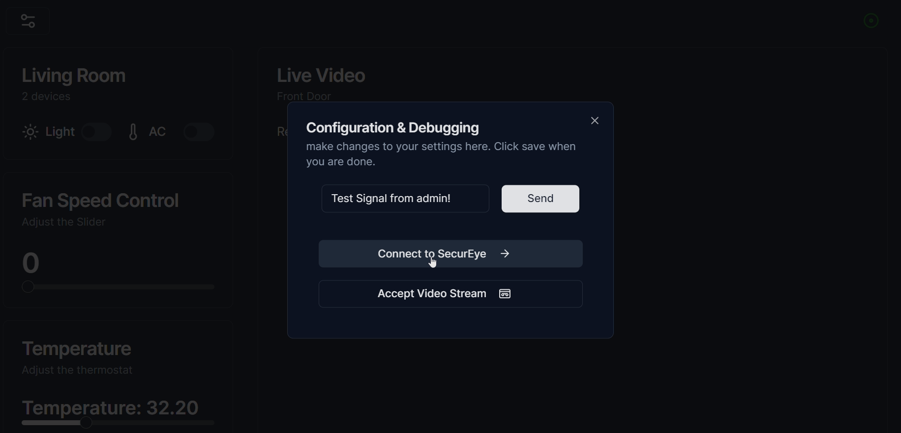

**NOTE:** Please be advised that the main branch exclusively contains the code for object detection only. This decision is made with the intention of deploying the main branch on a serverless architecture. Additionally, the administration panel necessitates WebSocket functionality, inherently unsuitable for deployment on a serverless platform. Consequently, for access to the complete codebase including the admin dashboard and video streaming capabilities, kindly refer to the dev-only branch.

# Secureye

Secureye is Nextjs web application that provides an admin panel for managing IoT devices and streaming live video feeds. It allows users to control various devices such as lights, air conditioners, and fans remotely using ESP8266 nodeMCU server, as well as view live video streams from surveillance cameras.

## Features

- **Device Control**: Control lights, air conditioners, and fans remotely from the admin panel.
- **Live Video Streaming**: View live video streams from surveillance cameras in real-time using WebRTC and web socket.
- **Sensor Data Monitoring**: Monitor temperature and humidity sensor data in the admin panel.
- **Responsive Design**: User interface designed to be responsive and accessible across devices.
- Real-time object detection using the COCO-SSD model.
- Recording video and taking photo and toggle camera.

## Technologies Used

- **Next.js**: Framework for building React applications with server-side rendering and routing.
- **Socket.IO**: Library for real-time web applications enabling bidirectional communication between clients and servers.
- **TensorFlow.js**: Machine learning framework for JavaScript applications.
- **Tailwind CSS**: Utility-first CSS framework for quickly building custom designs.
- **Axios**: Promise-based HTTP client for making API requests.

## Architecture Design


## Getting Started

1. Clone the repository:

   ```bash
   git clone https://github.com/rajeshiitk/secureye.git
   ```

2. Install dependencies:

   ```bash
   cd secureye
   npm install
   ```

3. Environment Variables

- `NEXT_PUBLIC_NODEMCU_URL`: URL for controlling NodeMCU
- `NEXT_PUBLIC_SITE_URL`: URL of Application
- `NEXT_PUBLIC_SERVER_BASE_URL`: Base URL for server which manage temperature data

4. Run the development server:

   ```bash
   npm run dev
   ```

## Usage

- Access the user interface at [http://localhost:3000](http://localhost:3000)
- Access the admin panel at [http://localhost:3000/admin](http://localhost:3000/admin)

## UI Design

| Admin                           | Admin Settings                                    | Main Settings                                   |
| ------------------------------- | ------------------------------------------------- | ----------------------------------------------- |
|  |  |  |

| Admin Desktop                            | Admin Desktop settings                                    |
| ---------------------------------------- | --------------------------------------------------------- |
|  |  |

## Basic NodeMU server Setup

```bash
#include <ESP8266HTTPClient.h>
#include <ESP8266WiFi.h>
#include <ESPAsyncTCP.h>
#include <ESPAsyncWebServer.h>
#include <Servo.h>
#include <DHT.h>
#define DHTPIN D2
#define DHTTYPE DHT11
DHT dht(DHTPIN, DHTTYPE);


Servo myservo;


// Replace with your network credentials
const char* ssid = "<wifi name>";
const char* password = "<password>";


const int output = D2;
const int FAN_PIN = D6;
const int LED_PIN = D7;


String sliderValue = "0";
String fanSpeedValue = "0";
String ledstatus ="off";


const char* PARAM_INPUT = "value";


// Create AsyncWebServer object on port 80
AsyncWebServer server(80);

void setup(){
  pinMode(LED_PIN, OUTPUT);
  pinMode(FAN_PIN, OUTPUT);


  myservo.attach(D3);

  // Serial port for debugging purposes
Serial.begin(9600);

  analogWrite(output, sliderValue.toInt());
  analogWrite(FAN_PIN, fanSpeedValue.toInt());
  // Connect to WiFi
  WiFi.begin(ssid, password);

  // while wifi not connected yet, print '.'
  // then after it connected, get out of the loop
  while (WiFi.status() != WL_CONNECTED) {
     delay(500);
     Serial.print("connecting !.");
  }
  //print a new line, then print WiFi connected and the IP address
  Serial.println("");
  Serial.println("WiFi connected");
  // Print the IP address
  Serial.println(WiFi.localIP());


  // Route for root / web page
  server.on("/", HTTP_GET, [](AsyncWebServerRequest *request){
    request->send(200, "text/plain", "seems okay");
  });

  // Send a GET request to <ESP_IP>/slider?value=<inputMessage>
  server.on("/fan", HTTP_GET, [] (AsyncWebServerRequest *request) {
    String inputMessage;

    // GET input1 value on <ESP_IP>/slider?value=<inputMessage>
    if (request->hasParam("speed")) {
      inputMessage = request->getParam("speed")->value();
      fanSpeedValue = inputMessage;
      // analogWrite(fanSpeed, fanSpeedValue.toInt());
        analogWrite(FAN_PIN, fanSpeedValue.toInt());
    }
    else {
      inputMessage = "No message sent";
    }
    Serial.println(inputMessage);

    request->send(200, "text/plain", "Ok");
  });

server.on("/light", HTTP_GET, [] (AsyncWebServerRequest *request) {
    String inputMessage;

    // GET input1 value on <ESP_IP>/slider?value=<inputMessage>
    if (request->hasParam("status")) {
      inputMessage = request->getParam("status")->value();
      ledstatus = inputMessage;
      // analogWrite(fanSpeed, fanSpeedValue.toInt());
      if(ledstatus == "on"){
         digitalWrite(LED_PIN, HIGH);
         }
      else{
          digitalWrite(LED_PIN, LOW);    // Turn LED off
      }
    }
    else {
      inputMessage = "No message sent";
    }
    Serial.println(inputMessage);

    request->send(200, "text/plain", "Ok");
  });

  server.on("/open", HTTP_GET, [] (AsyncWebServerRequest *request) {

    String inputMessage;
    myservo.write(180);

    request->send(200, "text/plain", "Opened");
  });
  server.on("/close", HTTP_GET, [] (AsyncWebServerRequest *request) {
    String inputMessage;
    myservo.write(-180);


    request->send(200, "text/plain", "Closed");
  });
DefaultHeaders::Instance().addHeader("Access-Control-Allow-Origin", "*");

  // Start server
  server.begin();
}

void loop() {
  float t = dht.readTemperature();
  float h = dht.readHumidity();
  //  float t = 23;
  // float h = 34;
  Serial.print("Temperature = ");
  Serial.println(t);
  Serial.print("Humidity = ");
  Serial.println(h);

  if (WiFi.status() == WL_CONNECTED) {
     WiFiClient client;
     HTTPClient http;
    String url = "<YOUR SERVER ADDRESS>/api/sensor?temperature=" + String(t) + "&humidity=" + String(h);
    http.begin(client, url);
    int httpCode = http.GET();
    if (httpCode > 0) {
      Serial.printf("[HTTP] GET... code: %d\n", httpCode);
    } else {
      Serial.printf("[HTTP] GET... failed, error: %s\n", http.errorToString(httpCode).c_str());
    }
    http.end();
  }

  delay(5000);
}

```
