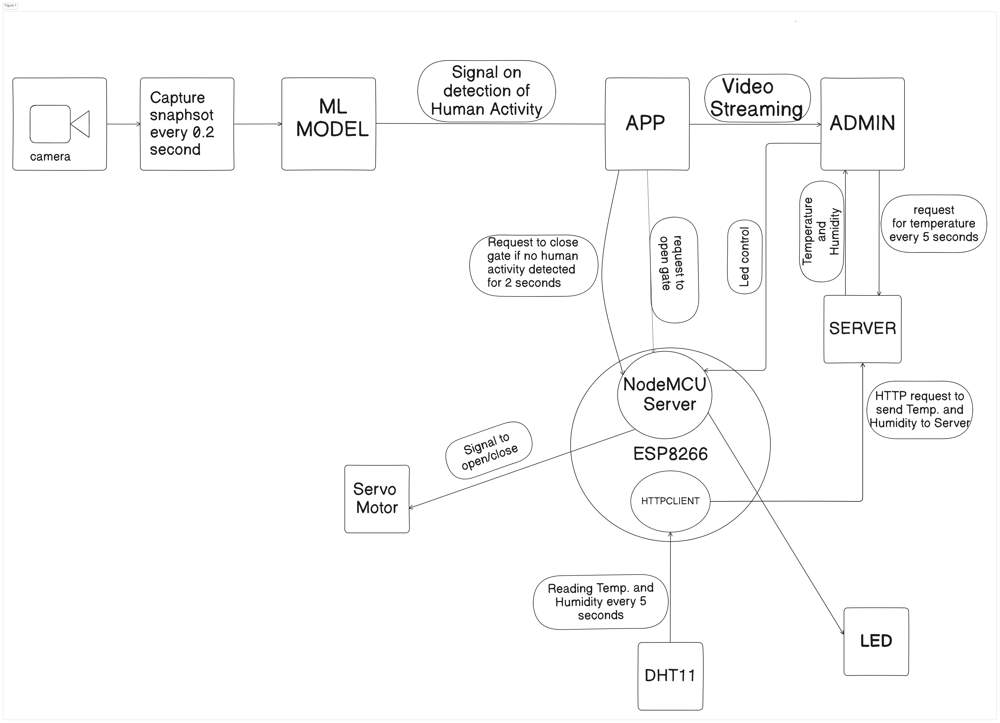

**NOTE:** Please be advised that the main branch exclusively contains the code for object detection only. This decision is made with the intention of deploying the main branch on a serverless architecture. Additionally, the administration panel necessitates WebSocket functionality, inherently unsuitable for deployment on a serverless platform. Consequently, for access to the complete codebase including the admin dashboard and video streaming capabilities, kindly refer to the dev-only branch.

# Secureye

Secureye is Nextjs web application that provides an admin panel for managing IoT devices and streaming live video feeds. It allows users to control various devices such as lights, air conditioners, and fans remotely using ESP8266 nodeMCU server, as well as view live video streams from surveillance cameras.

## Features

- **Device Control**: Control lights, air conditioners, and fans remotely from the admin panel.
- **Live Video Streaming**: View live video streams from surveillance cameras in real-time using WebRTC and web socket.
- **Sensor Data Monitoring**: Monitor temperature and humidity sensor data in the admin panel.
- **Responsive Design**: User interface designed to be responsive and accessible across devices.
- Real-time object detection using the COCO-SSD model.
- Recording video and taking photo and toggle camera.

## Technologies Used

- **Next.js**: Framework for building React applications with server-side rendering and routing.
- **Socket.IO**: Library for real-time web applications enabling bidirectional communication between clients and servers.
- **TensorFlow.js**: Machine learning framework for JavaScript applications.
- **Tailwind CSS**: Utility-first CSS framework for quickly building custom designs.
- **Axios**: Promise-based HTTP client for making API requests.

## Architecture Design



## Getting Started

1. Clone the repository:

   ```bash
   git clone https://github.com/rajeshiitk/secureye.git
   ```

2. Install dependencies:

   ```bash
   cd secureye
   npm install
   ```

3. Environment Variables

- `NEXT_PUBLIC_NODEMCU_URL`: URL for controlling NodeMCU
- `NEXT_PUBLIC_SITE_URL`: URL of Application
- `NEXT_PUBLIC_SERVER_BASE_URL`: Base URL for server which manage temperature data

4. Run the development server:

   ```bash
   npm run dev
   ```

## Usage

- Access the user interface at [http://localhost:3000](http://localhost:3000)
- Access the admin panel at [http://localhost:3000/admin](http://localhost:3000/admin)
